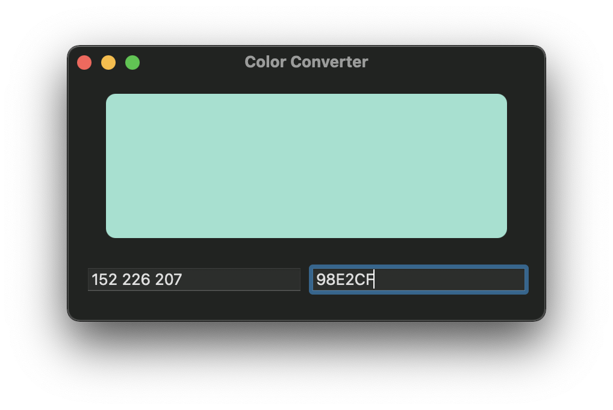

# Color Converter

A simple Mac utility written in SwiftUI that allows you to quickly convert between HEX codes and RGB values and to see them in effect in real-time.

## Motivation
Saves me a few more clicks while working.
